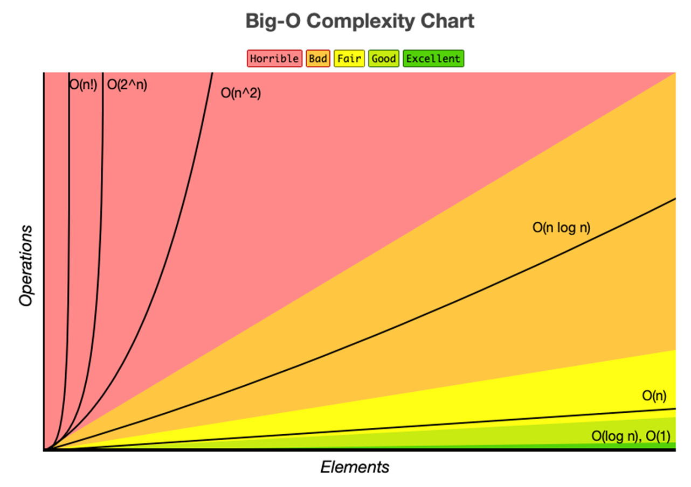

## 자료구조(Data Structure)

자료구조는 데이터의 표현과 저장 방식을 정의한다. 잘 설계된 자료구조는 프로그램의 성능을 최적화하여 실행 시간을 줄이고 메모리 사용을 효율화한다.

프로그램 개발 시 가장 중요한 초기 단계는 적절한 자료구조의 선택이다. 이는 데이터 처리 방식과 프로그램의 목적에 따라 달라진다.

일반적으로 자료구조는 다음과 같이 분류된다.

1. 선형 구조 (예: 배열, 리스트)
2. 비선형 구조 (예: 트리, 그래프)
3. 파일 구조
4. 해시 구조

각 구조는 고유한 특성과 용도를 가지며, 상황에 맞는 선택이 프로그램의 효율성을 좌우한다.

## 추상 자료형 (Abstract Data Type)

자료형은 데이터와 연산의 집합을 뜻한다. int의 경우 4byte 정수 범위를 데이터로 가지며, 산술연산자로 연산이 가능하다.

추상 자료형은 데이터 타입과 관련 연산을 수학적으로만 정의한 것이다. 구현 세부사항 없이 데이터 형태와 연산을 추상적으로 명시한 상태이다.

자료구조는 이러한 추상 자료형이 정의한 연산들의 실제 구현체라고 보면 된다. 이는 객체지향 프로그래밍의 클래스와 유사한 개념이다.

Java에서는 추상 자료형을 Interface로, 자료구조를 이를 구현한 Class로 비유할 수 있다. 이를 통해 추상화와 실제 구현의 관계를 이해할 수 있다.

## 알고리즘 (Algorithm)

자료구조가 데이터 저장 방식이라면, 알고리즘은 이를 활용해 문제를 해결하는 절차다.

좋은 알고리즘의 조건은 다음과 같다.

1. 입력: 0개 이상 존재
2. 출력: 1개 이상 필요
3. 명확성: 각 단계가 모호하지 않아야 함
4. 유한성: 정해진 단계 후 반드시 종료
5. 유효성: 실행 가능한 연산으로 구성

알고리즘 표현 방법은 크게 4가지다.

1. 자연어: 이해하기 쉽지만 정확한 정의 필요
2. 순서도: 직관적이나 복잡한 알고리즘 표현이 어려움
3. 의사코드: 간단한 코드 형태로 핵심 내용에 집중 가능
4. 프로그래밍 언어: 정확한 기술 가능하나 핵심 이해를 방해할 수 있음

## 시간 복잡도 & 공간 복잡도

효과적인 알고리즘을 위해 성능 분석과 평가가 필요하다.

컴퓨터에서는 시간과 메모리가 효율성 척도가 된다. 수행 시간 분석 결과를 시간 복잡도, 메모리 사용량 분석 결과를 공간 복잡도라고 한다.

시간 복잡도는 알고리즘 완료까지 걸리는 시간을 의미하나, 실제 실행 시간은 하드웨어나 프로그래밍 언어에 따라 달라지므로 고려하지 않는다. 대신 실행 명령어의 횟수를 뜻한다.

공간 복잡도는 메모리 사용량을 나타낸다.

시간복잡도 함수는 전체 연산 수를 계산해 실행 시간을 구하고 이를 함수로 표현한 것이다.

예를 들어

```java
void f(int n){
  int cnt = 0;              // 1
  int sum = 0;              // 1
  for(int i=0; i<n; i++){
    cnt++;                  // n
    sum += i;               // n
  }
}
```

## Big-O 표기법 (Big-O Notation)

알고리즘의 복잡도를 표현하는 대표적 방법으로, 최악의 경우를 나타낸다. 이는 시간 또는 공간의 상한선을 의미한다.

특징
복잡도 함수에서 입력값 n이 증가할 때 최고차항이 가장 큰 영향을 미치며, 다른 항과 상수 계수는 무시된다. 이렇게 최고차항만 고려하는 방식을 점근식 표기법이라고도 한다.

수학적 정의
f(n)과 g(n)이 주어졌을 때, n≥n₀에 대해 |f(n)| ≤ c·|g(n)|을 만족하는 상수 c와 n₀가 존재하면 f(n) = O(g(n))이다. 여기서 f(n)은 알고리즘의 복잡도, g(n)은 가장 영향력 있는 항을 의미한다.

예시

1. f(n) = 2n + 1 이면 O(n)이다. (n₀=2, c=3일 때, n≥2에서 2n + 1 ≤ 3·n)
2. f(n) = 3n² + 100 이면 O(n²)이다. (n₀=100, c=5일 때, n≥100에서 3n² + 100 ≤ 5·n²)

## Big-O 표기법의 종류 및 비교

O(1) < O(log[n]) < O(n) < O(n∗log[n]) < O(n²) < O(2ⁿ) < O(n!)


## Big-Ω & Big-θ 표기법

Big-O는 시간 또는 공간의 상한을 나타내었다.
Big-Ω는 반대로 하한을 나타낸다.
Big-θ는 O와 Ω를 동시에 만족하는 경우를 의미한다.

즉, 어떤 알고리즘이 O(n)과 Ω(n)을 모두 만족해야만 θ(n)을 만족하는 것이다.

## Big-O 표기법 사용

Big-Ω와 Big-θ 표기법이 있지만, 대부분의 경우 알고리즘의 시간복잡도를 표현할 때 Big-O 표기법만 사용한다.
여기서 중요한 사실이 있다.

예를들어 배열의 값을 찾는 알고리즘의 경우 시간복잡도를 O(n)으로 표현한다.

그러나 사실 Big-O는 함수의 상한만 표시하면 되므로 O(n²), 심지어 O(n!)로 표현해도 문제는 없다.

따라서 실제로는 알고리즘의 가장 타이트한 상한을 나타내는 Big-O를 사용한다.

즉, 함수의 상한에 존재하는 시간복잡도 중 가장 작은 시간복잡도로 표현하는 것이다.

## 최선, 평균, 최악의 경우

일반적으로 알고리즘을 평가할 때 최선의 경우와 최악의 경우를 따지기도 한다.

평균 케이스도 계산이 가능하지만, 최악의 경우가 가장 일반적으로 사용된다.

예를들어 배열 내의 어떠한 x값을 찾을 때 첫번째 index부터 순차적으로 찾는 알고리즘이 있다.

최선의 경우 첫번째 index에 x값이 위치하여 한번에 찾을 수 있을 것이다.

반면 최악의 경우 마지막 index에 x값이 위치하여 배열의 크기(n)만큼 전부 찾아야 할 것이다.

따라서 해당 알고리즘의 최선의 경우는 O(1), 최악의 경우는 O(n)이라고 말할 수 있다.

평균의 경우는 O(n/2)로, 이는 Big-O 표기법에서 O(n)과 동일하게 간주된다.
