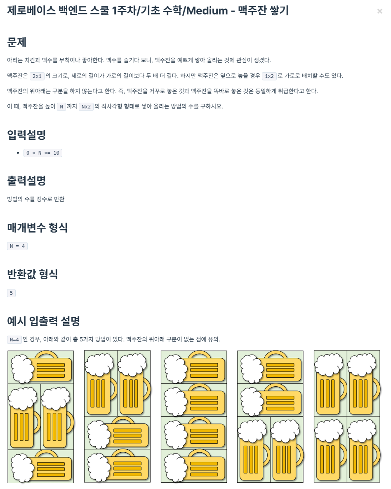

```java
class Solution {

    public int solution (int N) {
        int a = 1, b = 2;

        if (N == 1) {
            return a;
        }

        for (int i = 3; i <= N; i++) {
            int temp = a + b;
            a = b;
            b = temp;
        }

        return b;
    }
}
```

피보나치 수열을 구하는 문제입니다. N이 1일 때는 1을 반환하고, 그 외의 경우에는 2부터 N까지의 피보나치 수열을 구합니다.
a와 b를 1과 2로 초기화하고, for문을 통해 3부터 N까지 반복하면서 a와 b를 더한 값을 temp에 저장하고, a에는 b를, b에는 temp를 대입합니다.
반복문이 끝나면 b를 반환합니다.

시간 복잡도는 O(N)입니다.
