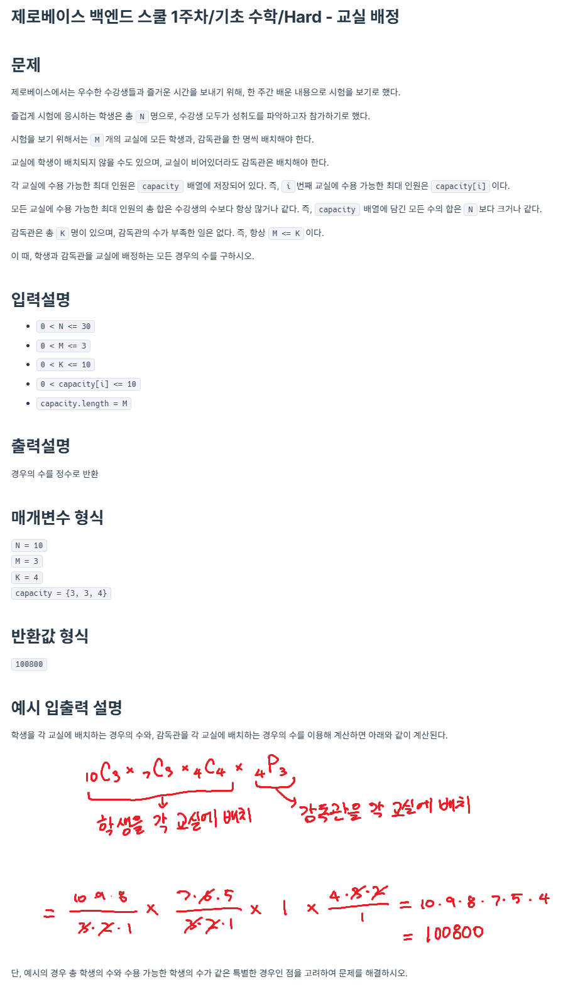

```java
import java.util.Arrays;

class Solution {
    public long solution (int N, int M, int K, int[] capacity) {
        int capacitySum = Arrays.stream(capacity).sum();

        long studentCases = 1;
        if (capacitySum == N) {
            int studentLeft = N;
            for (int cap: capacity) {
                studentCases *= nChooseK(studentLeft, cap);
                studentLeft -= cap;
            }
        } else {
            studentCases = 0;
            long capacityMult = Arrays.stream(capacity).asLongStream().
                    reduce(1, (x, y) -> x*(y+1));

            indexLoop:
            for (int i = 0; i < capacityMult; i++) {
                int[] caps = new int[M];
                long denominator = capacityMult;
                long numerator = i;
                int currentSum = 0;
                for (int j = 0; j < M; j++) {
                    denominator /= capacity[j] + 1;
                    caps[j] = (int)(numerator / denominator);
                    numerator %= denominator;

                    currentSum += caps[j];
                    if (currentSum > N) {
                        continue indexLoop;
                    }
                }

                long currentCase = 1;
                if (Arrays.stream(caps).sum() == N) {
                    int studentLeft = N;
                    for (int cap: caps) {
                        currentCase *= nChooseK(studentLeft, cap);
                        studentLeft -= cap;
                    }
                    studentCases += currentCase;
                }
            }
        }

        long kPm = 1;
        for (int i = K-M+1; i <= K; i++) {
            kPm *= i;
        }

        return studentCases * kPm;
    }

    private long nChooseK (int n, int k) {
        long numerator = 1;
        long denominator = 1;
        for (int i = 0; i < k; i++) {
            numerator *= n - i;
            denominator *= i + 1;
        }
        return numerator / denominator;
    }
}
```