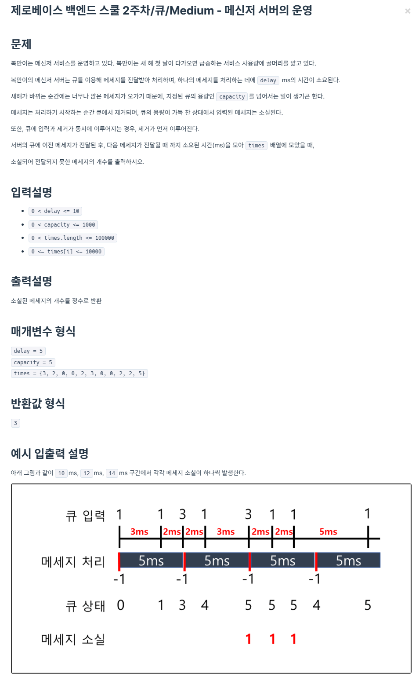

```java
class Solution {
    public int solution (int delay, int capacity, int[] times) {
        int currentTime = 0;
        int currentQueue = 0;
        int result = 0;
        for (int time: times) {
            currentTime += time;
            int sent = currentTime / delay;
            currentQueue = Math.max(0, currentQueue - sent);
            if (currentQueue == capacity) {
                result++;
            } else {
                currentQueue++;
            }
            currentTime %= delay;
        }
        return result;
    }
}
```