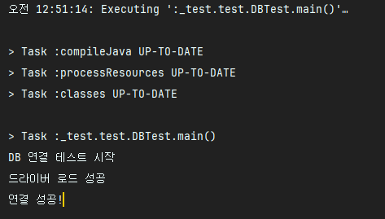

# 공공 와이파이 정보 서비스 프로젝트

## 프로젝트 개요
서울시 공공 와이파이 정보를 기반으로 사용자에게 주변 와이파이 검색, 즐겨찾기 관리, 위치 기록 저장 등의 기능을 제공합니다. 이 프로젝트는 데이터베이스 설계, API 통합, JSP 기반 UI, 서블릿 및 Java 기반 백엔드 로직 구현 등으로 구성되어 있으며, **시각장애인을 위한 접근성 기능**을 추가로 포함하고 있습니다.

---

## 주요 기능
1. **와이파이 정보 관리**
    - 공공 API를 통해 와이파이 정보를 주기적으로 가져와 데이터베이스에 저장
    - 사용자의 현재 위치를 기준으로 반경 내 와이파이 정보를 검색

2. **즐겨찾기 및 그룹 관리**
    - 와이파이를 즐겨찾기로 등록 및 그룹화
    - 즐겨찾기 그룹 추가, 삭제, 수정, 조회 기능

3. **위치 기록 관리**
    - 사용자가 방문한 위치를 기록
    - 위치 기록 추가, 조회, 삭제 기능

4. **접근성 지원**
    - **시각장애인을 위한 음성 안내 기능** 제공
    - 웹 페이지에 접근성 향상을 위한 ARIA 속성 추가
    - 키보드만으로도 모든 기능에 접근 가능하도록 설계

---

## 데이터베이스 설계
프로젝트의 핵심 데이터베이스 구조는 다음과 같습니다.

### ERD 개요
- **wifi_info**: 공공 와이파이 정보를 저장
- **bookmark**: 즐겨찾기 관리
- **bookmark_group**: 즐겨찾기 그룹 관리
- **location_history**: 사용자 위치 기록 관리

---

## 기술 스택
- **언어**: Java 8
- **프레임워크**: JSP/Servlet
- **데이터베이스**: MariaDB 3.0.3
- **빌드 도구**: Gradle
- **서버**: Apache Tomcat 9.0.97
- **API 통합**: OpenAPI (서울 공공 데이터)
- **테스트 도구**: Postman

---

## 디렉토리 구조

다음은 프로젝트의 전체 디렉토리 구조를 나타냅니다.

---

## 실행 방법

1. **데이터베이스 설정**
    - MariaDB 연결 정보
        - 호스트: `192.168.***.***` (내부 네트워크 IP)
        - 데이터베이스: `testdb1`
        - 사용자명: `root`
        - 비밀번호: `******` (보안상의 이유로 비밀번호는 숨김 처리)

2. **프로젝트 설정**
    - `build.gradle` 파일을 기반으로 필요한 의존성을 다운로드
    - Tomcat 9.0.97 이상에 배포

3. **실행**
    - `http://localhost:8080/`로 접속하여 프로젝트 기능 확인

4. **API 테스트**
    - Postman을 사용하여 API의 응답을 테스트할 수 있습니다.

---

## 주요 파일 설명

- **JSP**: 프론트엔드 페이지 렌더링
- **Servlet**: 각 기능별 요청 처리
- **Service**: 비즈니스 로직 수행
- **DAO**: 데이터베이스와의 상호작용

---

## 구현 영상
[프로젝트 데모 영상 보기](https://drive.google.com/file/d/1x6u4aeE6PAKsKoJuqXt7Ik2wXes8h1cM/view?usp=drive_link)

---

## 참고 사항
- 데이터베이스 연결 정보는 필요시 수정 가능합니다.
- API 키는 `WifiService.java` 파일에서 수정할 수 있습니다.
- Gradle 기반의 프로젝트로 `build.gradle`을 통해 빌드 및 의존성 관리가 가능합니다.

---

## 작성자
- 전도명